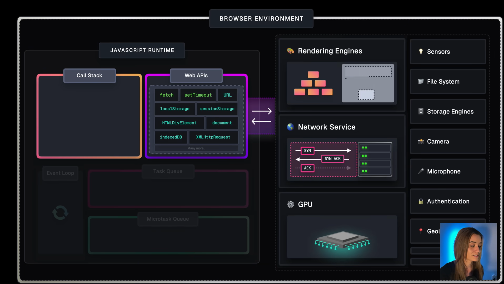
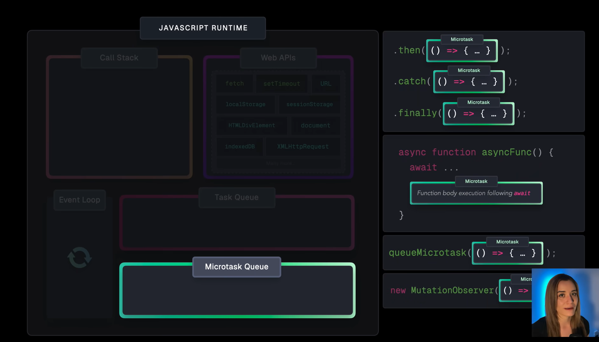

# Quick Note

**What is Node.js?**

Node.js is a JavaScript runtime built on Chrome’s V8 engine that allows you to run JavaScript on the server-side. It uses an event-driven, non-blocking I/O model, making it efficient for scalable applications.

**What are the key features of Node.js?**

- _Asynchronous and Event-Driven:_ Non-blocking I/O operations.
- _Single-Threaded with Event Loop:_ Uses a single thread but manages multiple - requests efficiently.
- _Built-in Libraries:_ Comes with modules like fs, http, path, etc.
- _Fast Execution:_ Uses the V8 engine for fast performance.
- _Cross-Platform:_ Runs on Windows, macOS, and Linux.

**What are the types of Node.js modules?**

_Core Modules_ – Built-in (fs, http, path, events).
_Local Modules_ – Custom modules created by developers.
_Third-Party Modules_ – Installed via NPM (e.g., express, mongoose, axios).

## Asynchronous Programming

**What are callbacks, and how do they work?**

A callback is a function passed as an argument to another function, executed later.

```js
function fetchData(callback) {
  setTimeout(() => {
    callback("Data received!");
  }, 2000);
}

fetchData((data) => {
  console.log(data);
});
```

The main reason for using callback functions is to ensure that code execution is asynchronous and non-blocking, which is crucial for handling operations like API calls, file reading, or event handling.

**What is the difference between synchronous and asynchronous code?**

_Synchronous:_ Executes one task at a time (blocking).
_Asynchronous:_ Executes multiple tasks concurrently (non-blocking).

**What are Promises, and how do they improve async operations?**

Promises are used to handle asynchronous operations without callback hell.

```js
const fetchData = () => {
  return new Promise((resolve, reject) => {
    setTimeout(() => {
      resolve("Data received!");
    }, 2000);
  });
};

fetchData()
  .then((data) => console.log(data))
  .catch((err) => console.error(err));
```

**What is async/await? How is it different from Promises?**

- `async/await` makes asynchronous code look synchronous.
- `await` pauses execution until the Promise resolves.

```js
async function fetchData() {
  let data = await fetchDataFromServer();
  console.log(data);
}
```

**why the need of callback function in js**

A callback function in JavaScript is a function that is passed as an argument to another function and is executed later, usually after an operation has completed.

The main reason for using callback functions is to ensure that code execution is asynchronous and non-blocking, which is crucial for handling operations like API calls, file reading, or event handling.

- Asynchronous Execution
- Avoiding Blocking Operations

```js
function delay() {
  for (let i = 0; i < 1e9; i++) {} // Blocks execution for a while
  console.log("Blocking done!");
}
console.log("Before delay");
delay();
console.log("After delay"); // Runs only after `delay()` is finished
```

```js
console.log("Before delay");
setTimeout(() => {
  console.log("Non-blocking done!");
}, 2000);
console.log("After delay");
```

- Event Handling
- Handling API Requests
- Higher-Order Functions
-

## Event Loop & Process Management






## Security & Best Practices

What are common security vulnerabilities in Node.js?
Cross-Site Scripting (XSS) – Use data sanitization.
Cross-Site Request Forgery (CSRF) – Use CSRF tokens.
Rate Limiting – Prevent brute-force attacks.

## Deployment & Performance

- Use PM2 for process management.
- Deploy on VPS, AWS, Heroku, or Docker.
- Use Nginx as a reverse proxy.

**How do you improve Node.js performance?**

- Use gzip compression.
- Use cluster mode (node: cluster).
- Optimize database queries with indexes.
