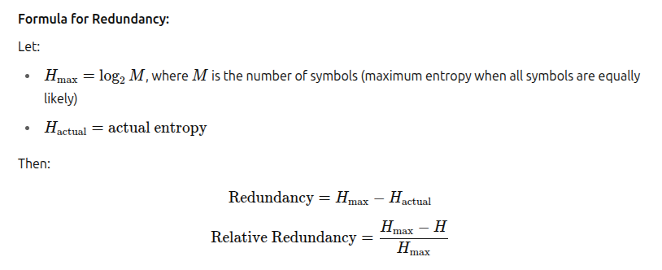

# Introduction to Information Theory

- **What is it?** The mathematical study of information, quantifying information, communication, and data compression.
- **Applications:** Data transmission, compression, cryptography, error correction.

## What is Entropy in Information Theory?

Entropy is a measure of the average uncertainty or information content in a random variable or message source.

For a discrete random variable 𝑋 with outcomes x1, x2, x3, ...xm  and corresponding probabilities p(x1), p(x2). p(x3), ... (pxm)

The Shannon entropy is defined as:

- Where p(x) is the probability of event x.
- High entropy = more unpredictable (uniform distribution).
- Low entropy = more predictable.
- Units: bits (if base 2 is used).
- **Interpretation:** the more unpredictable the message, the higher the entropy.

> Example: A fair coin (50-50 heads/tails) has more entropy than a biased coin (90% heads).

## Questions

### Show that Entropy is Maximum When All Outcomes Are Equiprobable (Assume M = 3)

---

## Uncertainty in Information Theory

Uncertainty refers to the lack of predictability or degree of surprise in the outcome of a random variable or a message source.

In other words, uncertainty tells us how much we do not know about the message before it is received.

### Explanation:

If all messages (symbols) from a source are equally likely, then the uncertainty is maximum. The more skewed or biased the probabilities are, the less uncertain the source is because some outcomes become more predictable.

This concept is quantified using Shannon Entropy, which gives the average amount of information per symbol.

Shannon's Entropy Formula:

---

## Redundancy in Information Theory

Redundancy refers to the extra information or repetition in a message that does not add to its meaning but is useful for error detection, correction, or compression.

Redundancy measures how much the actual information differs from the maximum possible information (i.e., the maximum entropy).

Redundancy helps in:

- Making communication reliable (e.g., error checking in networks).
- Allowing compression (e.g., in text/image files).
- Supporting fault tolerance (e.g., in CDs, QR codes).

Redundancy, though representing repeated or non-informative parts of a message, plays a vital role in reliable and efficient communication systems.

In error detection, redundancy is used to identify transmission errors by adding parity bits or checksums. For example, a parity bit ensures that the number of 1’s remains even or odd; any deviation implies an error.

In error correction, redundancy allows the original message to be reconstructed even when some bits are corrupted. Techniques like Hamming codes use extra bits for locating and correcting single-bit errors.

Finally, in data compression, redundancy is exploited to reduce message size. Frequent patterns or symbols are encoded with fewer bits, as seen in Huffman coding or ZIP files.

Thus, redundancy is essential not only for maintaining accuracy and reliability but also for achieving efficiency in digital communication systems.