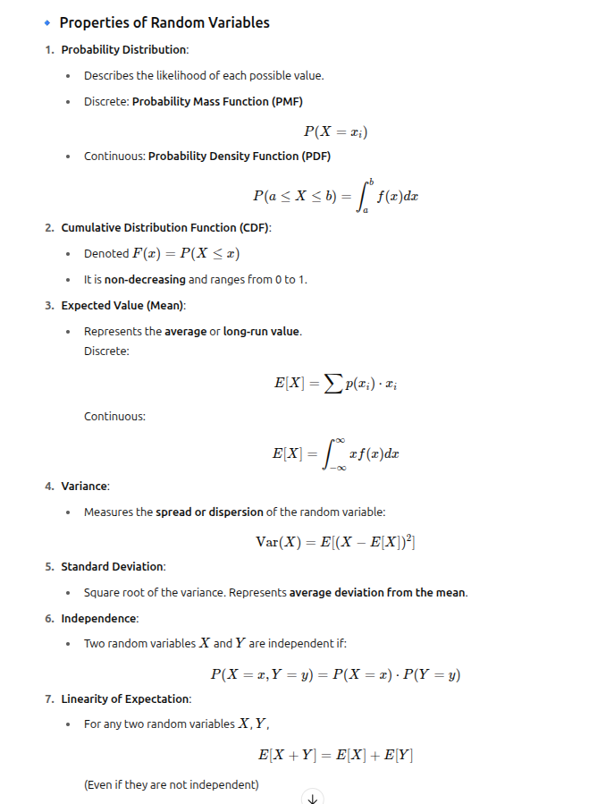
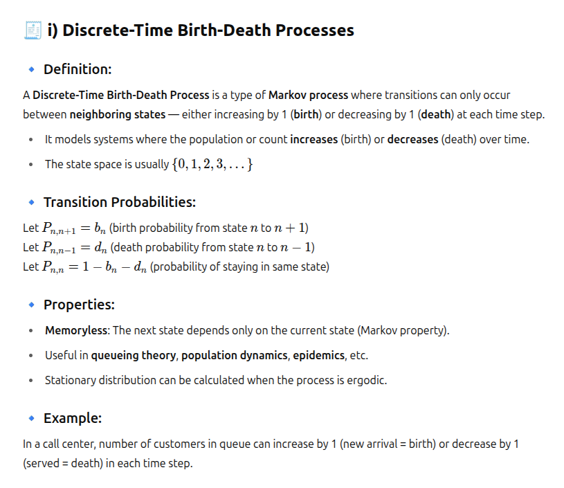
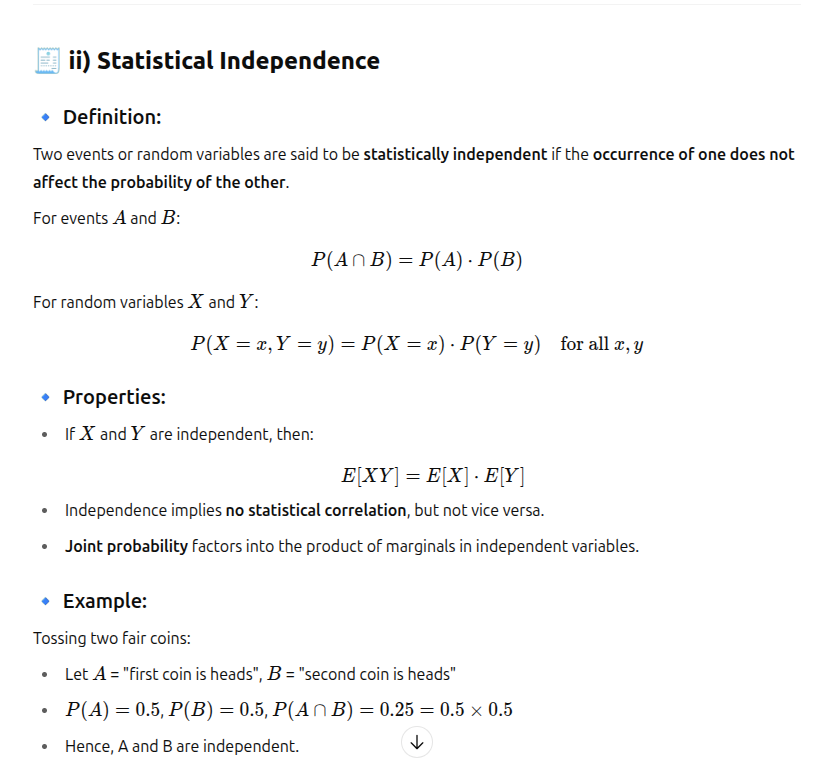

# Probability

## Random Variable and Its Properties

A random variable is a function that assigns a real number to each outcome in a sample space of a random experiment.

It provides a way to quantify outcomes of a probabilistic event.

There are two main types:

- Discrete Random Variable: Takes a countable number of distinct values. Example: Number rolled on a die -> x = {1,2,3,4,5,6}
- Continuous Random Variable: Takes uncountably infinite values in an interval.
Example: Time taken to complete a task X belows to [0, inf]

## Notation

- A random variable is usually denoted by capital letters like 𝑋,𝑌
- Its specific values are denoted by lowercase letters like 𝑥, 𝑦

## Properties of Random Variables

---

---

